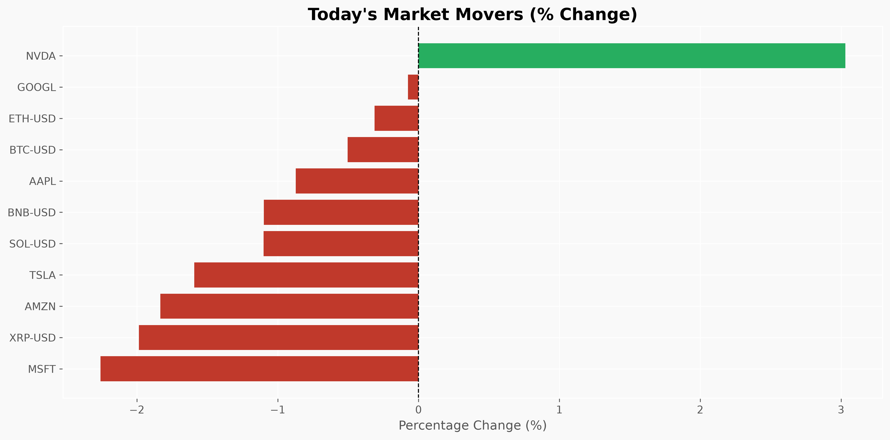
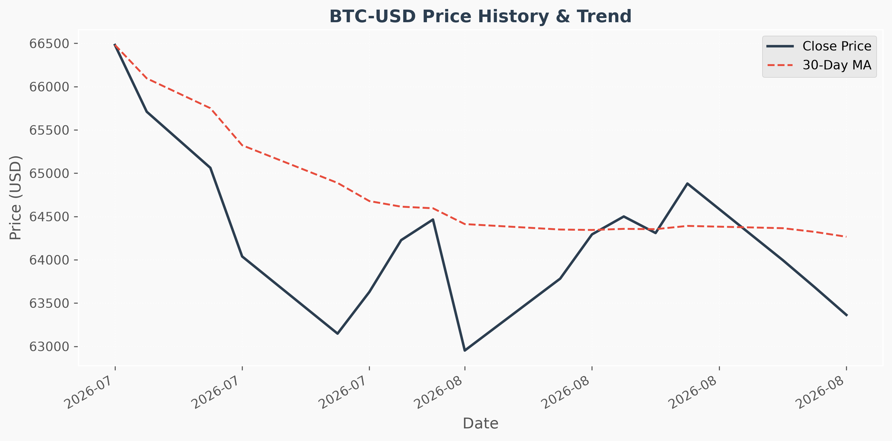
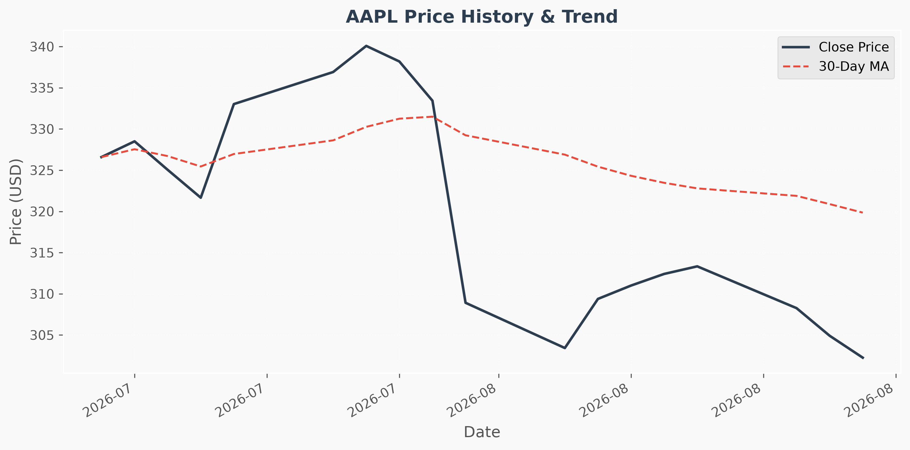

# Daily Market Data Pipeline

[](https://github.com/USERNAME/market-data-pipeline/actions/workflows/daily_pipeline.yml)

A production-ready data engineering pipeline that automatically collects daily stock and cryptocurrency market data, cleans it, calculates analytics, generates charts, and updates this README dashboard using Python and GitHub Actions.

---

<!-- DASHBOARD_START -->

## 📅 Daily Market Dashboard

*Last Updated: 2026-08-13 01:25 UTC*

### Stocks

| Asset | Price | 24h Change | 7-Day MA |
|-------|-------|------------|----------|
| **AAPL** | $302.25 | -0.87% | $308.79 |
| **AMZN** | $267.28 | -1.83% | $273.49 |
| **GOOGL** | $343.54 | -0.08% | $356.71 |
| **MSFT** | $492.43 | -2.26% | $497.49 |
| **NVDA** | $224.09 | +3.03% | $219.04 |
| **TSLA** | $327.51 | -1.59% | $326.89 |

### Crypto

| Asset | Price | 24h Change | 7-Day MA |
|-------|-------|------------|----------|
| **BNB-USD** | $609.60 | -1.10% | $600.77 |
| **BTC-USD** | $63,363 | -0.50% | $64,146.53 |
| **ETH-USD** | $1,875 | -0.31% | $1,888.87 |
| **SOL-USD** | $75.48 | -1.10% | $74.51 |
| **XRP-USD** | $1.00 | -1.99% | $1.03 |

### 📈 Daily Market Movers

- **Top Gainer:** NVDA (+3.03%)
- **Top Loser:** MSFT (-2.26%)

### 📉 Latest Charts



<div style='display: flex; gap: 10px;'>


</div>

### 📊 Dataset Statistics

- **Historical Days Collected:** 22
- **Total Records:** 193
- **Pipeline Status:** Healthy 🟢

<!-- DASHBOARD_END -->

---

## 🏗️ Architecture & Project Structure

The pipeline is built using a modular Python architecture.

```text
market-data-pipeline/
├── data/                   # Raw and processed CSV datasets
├── charts/                 # Generated Matplotlib visualizations
├── src/                    # Core Python modules
│   ├── config.py           # Configuration and assets
│   ├── logger.py           # Standardized logging
│   ├── fetch.py            # API ingestion
│   ├── clean.py            # Data cleaning and validation (Pandas)
│   ├── analytics.py        # Moving averages and volatility
│   ├── charts.py           # Data visualization
│   └── update_readme.py    # Markdown dashboard generation
├── .github/workflows/      # GitHub Actions CI/CD automation
├── main.py                 # Orchestrator script
└── requirements.txt        # Python dependencies
```

## 🔄 Pipeline Flow

1. **GitHub Actions Trigger:** The workflow `.github/workflows/daily_pipeline.yml` runs every day at midnight UTC (or manually).
2. **Data Ingestion (`fetch.py`):** Downloads the latest OHLCV market data using a public API. Includes robust retries, timeouts, and error handling.
3. **Data Cleaning (`clean.py`):** Loads the raw JSON, formats timestamps, handles missing values, and appends the new data to historical CSVs (`data/stocks.csv`, `data/crypto.csv`) while preventing duplicates.
4. **Analytics (`analytics.py`):** Calculates 7-day and 30-day Moving Averages, Daily Returns, and Volatility using Pandas rolling windows.
5. **Visualization (`charts.py`):** Generates PNG charts using Matplotlib to visualize price history and portfolio summaries.
6. **Dashboard Update (`update_readme.py`):** Parses the generated analytics and dynamically rewrites the Dashboard section in this `README.md`.
7. **Automated Commit:** The GitHub Actions runner commits and pushes the updated data, charts, and README back to the repository if changes exist.

## 🚀 Installation & Running Locally

1. **Clone the repository**
   ```bash
   git clone https://github.com/USERNAME/market-data-pipeline.git
   cd market-data-pipeline
   ```

2. **Create a virtual environment (Optional but recommended)**
   ```bash
   python -m venv venv
   source venv/bin/activate  # On Windows: venv\Scripts\activate
   ```

3. **Install dependencies**
   ```bash
   pip install -r requirements.txt
   ```

4. **Run the pipeline**
   ```bash
   python main.py
   ```

## ⚙️ Customization

You can easily track different assets by modifying the `STOCKS` and `CRYPTO` lists inside `src/config.py`. 

```python
STOCKS = ["AAPL", "MSFT", "NVDA", "GOOGL", "AMZN", "TSLA", "META"]
CRYPTO = ["BTC-USD", "ETH-USD", "SOL-USD"]
```

## 🔮 Future Improvements
- [ ] Connect a PostgreSQL database or BigQuery for scalable storage.
- [ ] Add Email/Slack notifications for daily summaries or price alerts.
- [ ] Integrate a paid financial API (e.g., Alpha Vantage, Polygon) for higher frequency data.
- [ ] Implement data quality testing using Great Expectations.

## 📄 License

This project is licensed under the MIT License - see the [LICENSE](LICENSE) file for details.
